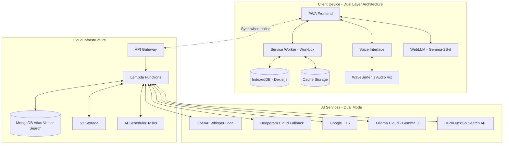
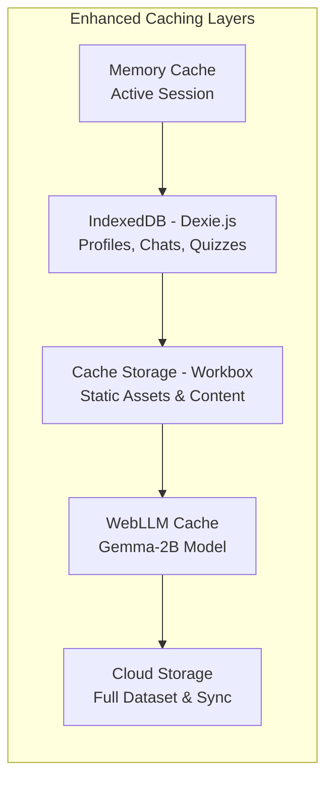

# Design Document: DigiMasterJi

## Overview

DigiMasterJi is a voice-first, offline-first, multilingual AI-powered tutoring platform specifically designed for rural education in India, with advanced features addressing India's unique educational challenges. The system provides comprehensive educational support through curriculum-grounded AI responses, gamified learning experiences, and sophisticated offline capabilities.

The architecture prioritizes resilience, accessibility, and educational effectiveness in resource-constrained environments. Key design principles include dual-layer offline-first operation with browser-based LLM, privacy-conscious audio processing, Netflix-style multi-student profiles on shared devices, and strict curriculum alignment through RAG to prevent AI hallucinations.

## Architecture

### High-Level Architecture



### Dual-Layer Offline-First Design Pattern

The system implements a **"Dual-Layer Offline-First with Browser LLM"** pattern:

1. **Layer 1 - Local Browser AI**: Complete AI functionality using WebLLM with Gemma-2B-it model (~1.5GB) running entirely in browser with WebGPU acceleration
2. **Layer 2 - Cloud Enhancement**: Enhanced AI using Ollama with Gemma 3 (12B/3B/1B variants) when online
3. **Zero Latency Offline**: Instant AI responses without internet using cached browser-based LLM
4. **Seamless Transition**: Automatic switching between local and cloud AI based on connectivity
5. **Graceful Degradation**: Full functionality available offline with cached content and local AI processing

### Multi-Layer Caching Strategy



## Components and Interfaces

### 1. Progressive Web App (PWA) Frontend

**Technology Stack**: React 18 + Vite + TypeScript + Workbox
**Key Features**:
- Service Worker with Workbox for advanced offline functionality
- Responsive design optimized for mobile devices
- Voice-first UI with minimal visual dependencies
- Netflix-style multi-student profile management
- Real-time audio visualization with WaveSurfer.js
- "Night School" audio-only mode for accessibility

**Core Components**:
```typescript
interface StudentProfile {
  id: string;
  name: string;
  preferredLanguage: string;
  gradeLevel: number;
  voiceSignature: string;
  learningProgress: LearningProgress;
  gamification: GamificationData;
  streaks: StreakData;
  badges: Badge[];
  xpPoints: number;
  level: number;
}

interface GamificationData {
  totalXP: number;
  currentLevel: number;
  dailyStreak: number;
  longestStreak: number;
  badges: Badge[];
  weeklyGoals: WeeklyGoal[];
  leaderboardRank: number;
}

interface VoiceInterface {
  startListening(language: string): Promise<void>;
  stopListening(): Promise<string>;
  speak(text: string, language: string): Promise<void>;
  setLanguage(language: string): void;
  visualizeAudio(audioStream: MediaStream): void;
  enableNightMode(): void;
}
```

### 2. Enhanced Voice Interface System

**Speech-to-Text**: 
- Primary: OpenAI Whisper (local processing)
- Fallback: Deepgram Cloud API
- Browser Web Speech API (emergency fallback)
- Real-time audio visualization with WaveSurfer.js

**Text-to-Speech**:
- Primary: Google TTS with multilingual Indian voices
- Offline: Browser Speech Synthesis API
- Cached audio responses for common interactions

**Language Support**: Hindi, English, Bengali, Telugu, Marathi, Tamil, Gujarati, Kannada, Malayalam, Odia, Punjabi, Urdu, Nepali (12+ languages)

**Audio-Only "Night School" Mode**: Complete functionality without visual elements for late-night study or visual impairments

```typescript
interface EnhancedSpeechProcessor {
  transcribe(audioBlob: Blob, language: string): Promise<string>;
  synthesize(text: string, language: string, voice?: string): Promise<AudioBuffer>;
  detectLanguage(audioBlob: Blob): Promise<string>;
  visualizeAudio(stream: MediaStream): WaveSurfer;
  enableNightMode(): void;
  processLocalWhisper(audio: Blob): Promise<string>;
  fallbackToDeepgram(audio: Blob): Promise<string>;
}
```

### 3. Curriculum-Grounded RAG Engine

**Vector Database**: MongoDB Atlas Vector Search
**Embedding Model**: sentence-transformers/all-MiniLM-L6-v2 (384-dimensional)
**Content Source**: NCERT textbooks with optimized chunking strategy
**Chunking Strategy**: 500-token chunks with 50-token overlap for optimal context retrieval

**Enhanced RAG Pipeline**:
1. **Document Processing**: PDF extraction → 500-token chunking → 384-dim embedding generation
2. **Query Processing**: Voice input → Text → Query embedding
3. **Semantic Retrieval**: Vector similarity search in MongoDB Atlas
4. **Context-Aware Generation**: Dual LLM mode (WebLLM offline / Ollama cloud)
5. **Learning Insights**: RAG-enhanced recommendations for weak topics
6. **Response Delivery**: Text → Speech synthesis with citations

```typescript
interface EnhancedRAGEngine {
  processDocument(pdf: File, metadata: DocumentMetadata): Promise<void>;
  query(question: string, studentContext: StudentProfile): Promise<RAGResponse>;
  generateInsights(studentHistory: LearningSession[]): Promise<LearningInsight[]>;
  validateResponse(response: string, sources: NCERTSource[]): boolean;
  getWeakTopicContent(topics: string[]): Promise<ContextualContent[]>;
}

interface RAGResponse {
  answer: string;
  sources: NCERTSource[];
  confidence: number;
  language: string;
  relatedTopics: string[];
  difficultyLevel: number;
}

interface LearningInsight {
  type: 'weakness' | 'strength' | 'recommendation';
  subject: string;
  topic: string;
  content: string;
  ragContext: NCERTSource[];
  actionable: boolean;
}
```

### 4. Dual-Layer Offline Data Management

**IndexedDB with Dexie.js Schema**:
```typescript
interface EnhancedOfflineDatabase {
  students: StudentProfile[];
  conversations: Conversation[];
  messages: Message[];
  quizzes: GeneratedQuiz[];
  learningInsights: LearningInsight[];
  cachedContent: CachedNCERTContent[];
  pendingSync: SyncOperation[];
  gamificationData: GamificationData[];
  badges: Badge[];
  streakHistory: StreakRecord[];
}

interface WebLLMCache {
  modelPath: string;
  modelSize: number; // ~1.5GB for Gemma-2B-it
  lastLoaded: Date;
  isReady: boolean;
}
```

**Enhanced Sync Manager with Conflict Resolution**:
```typescript
interface EnhancedSyncManager {
  queueOperation(operation: SyncOperation): void;
  syncWhenOnline(): Promise<SyncResult>;
  resolveConflicts(conflicts: DataConflict[]): Promise<void>;
  prioritizeSync(operations: SyncOperation[]): SyncOperation[];
  handleMultiDayOffline(offlineDays: number): Promise<void>;
  mergeGamificationData(local: GamificationData, cloud: GamificationData): GamificationData;
}
```

### 5. Dual-Mode AI System

**Browser-Based AI (Offline)**:
- WebLLM with @mlc-ai/web-llm
- Gemma-2B-it-q4f32_1-MLC model (~1.5GB)
- WebGPU acceleration for performance
- Zero latency responses without internet

**Cloud-Based AI (Online)**:
- Ollama integration with Gemma 3 variants
- Model options: 12B, 3B, or 1B based on requirements
- Enhanced reasoning capabilities for complex queries

**Web Search Integration**:
- DuckDuckGo API integration
- Optional web search button near chat prompt
- Contextual search results integration with RAG responses

```typescript
interface DualModeAI {
  // Offline Browser LLM
  initializeWebLLM(): Promise<void>;
  generateOfflineResponse(prompt: string, context: RAGContext): Promise<string>;
  
  // Online Cloud LLM
  generateCloudResponse(prompt: string, context: RAGContext): Promise<string>;
  
  // Automatic mode switching
  selectOptimalMode(): 'offline' | 'online';
  
  // Web search integration
  searchWeb(query: string): Promise<SearchResult[]>;
  integrateSearchResults(results: SearchResult[], ragContext: RAGContext): Promise<string>;
}

interface WebLLMConfig {
  modelId: 'Gemma-2B-it-q4f32_1-MLC';
  modelSize: 1536; // MB
  webgpuEnabled: boolean;
  maxTokens: number;
}
```

### 6. Advanced Gamified Learning System

**Comprehensive Gamification Engine**:
```typescript
interface GamificationEngine {
  calculateXP(activity: LearningActivity): number;
  updateStreak(studentId: string, activity: Date): StreakData;
  checkBadgeEligibility(student: StudentProfile): Badge[];
  generateLeaderboard(familyProfiles: StudentProfile[]): LeaderboardEntry[];
  handleMissedDays(studentId: string, missedDays: number): QuizBacklog;
  recoverStreak(studentId: string, recoveryAction: string): boolean;
}

interface Badge {
  id: string;
  name: string;
  description: string;
  icon: string;
  criteria: BadgeCriteria;
  earnedDate?: Date;
}

// 15+ Achievement Badges
const AVAILABLE_BADGES = [
  'First Steps', 'On Fire', 'Week Warrior', 'Perfectionist', 
  'Math Wizard', 'Science Explorer', 'Language Master', 'Quiz Champion',
  'Streak Keeper', 'Night Owl', 'Early Bird', 'Comeback Kid',
  'Helper', 'Curious Mind', 'Problem Solver'
];

interface StreakData {
  currentStreak: number;
  longestStreak: number;
  lastActivity: Date;
  streakRecoveryUsed: boolean;
  weeklyGoalMet: boolean;
}
```

**Automated Quiz Generation with APScheduler**:
```typescript
interface QuizScheduler {
  generateDailyQuiz(studentId: string): Promise<GeneratedQuiz>;
  scheduleBackgroundTask(studentId: string, time: string): void;
  handleMissedQuizzes(studentId: string): QuizBacklog;
  adaptDifficulty(studentHistory: QuizResult[]): number;
}
```

### 7. AI-Powered Learning Analytics

**Automated Insight Generation**:
```typescript
interface LearningAnalytics {
  generateInsights(studentId: string): Promise<LearningInsight[]>;
  analyzePerformanceTrends(quizHistory: QuizResult[]): PerformanceAnalysis;
  identifyWeakTopics(studentData: StudentProfile): WeakTopic[];
  generateRecommendations(insights: LearningInsight[]): StudyRecommendation[];
  createBilingualReport(insights: LearningInsight[], language: string): AnalyticsReport;
}

interface LearningInsight {
  id: string;
  studentId: string;
  type: 'strength' | 'weakness' | 'recommendation' | 'trend';
  subject: string;
  topic: string;
  description: string;
  ragEnhancedContent: NCERTSource[];
  actionable: boolean;
  priority: 'high' | 'medium' | 'low';
  generatedAt: Date;
  language: string;
}

interface PerformanceAnalysis {
  subjectWisePerformance: Map<string, number>;
  improvementTrends: TrendData[];
  consistencyScore: number;
  recommendedFocusAreas: string[];
  visualizationData: ChartData[];
}
```

**Background Task Integration**:
```typescript
interface AnalyticsScheduler {
  triggerInsightGeneration(studentId: string, trigger: 'quiz_completed' | 'daily' | 'weekly'): void;
  schedulePerformanceAnalysis(studentId: string): void;
  updateLearningPatterns(studentId: string): Promise<void>;
}
```

### 8. Backend Services (AWS Serverless + APScheduler)

**Enhanced API Gateway + Lambda Functions**:
- `/auth/student` - Netflix-style profile management
- `/content/sync` - Enhanced content synchronization with conflict resolution
- `/speech/transcribe` - OpenAI Whisper + Deepgram fallback
- `/speech/synthesize` - Google TTS multilingual generation
- `/ai/query` - Dual-mode AI (WebLLM/Ollama) with RAG
- `/gamification/update` - XP, badges, streaks management
- `/analytics/insights` - AI-powered learning analytics
- `/quiz/generate` - Automated daily quiz generation
- `/search/web` - DuckDuckGo API integration
- `/admin/content` - Enhanced content management

**MongoDB Collections with Vector Search**:
```typescript
// Enhanced student profiles with gamification
interface StudentDocument {
  _id: ObjectId;
  deviceId: string;
  profiles: StudentProfile[];
  gamificationData: GamificationData[];
  lastSync: Date;
  syncConflicts: ConflictRecord[];
}

// NCERT content with optimized embeddings
interface ContentDocument {
  _id: ObjectId;
  textbook: string;
  chapter: string;
  section: string;
  content: string;
  embedding: number[]; // 384-dimensional vector
  chunkIndex: number;
  overlapTokens: number;
  metadata: ContentMetadata;
}

// Learning insights with RAG context
interface InsightDocument {
  _id: ObjectId;
  studentId: string;
  insights: LearningInsight[];
  ragContext: NCERTSource[];
  generatedAt: Date;
  language: string;
}
```

**APScheduler Background Tasks**:
```typescript
interface ScheduledTasks {
  dailyQuizGeneration: CronJob;
  insightGeneration: CronJob;
  streakMaintenance: CronJob;
  syncConflictResolution: CronJob;
  performanceAnalysis: CronJob;
}
```

## Correctness Properties

*A property is a characteristic or behavior that should hold true across all valid executions of a system—essentially, a formal statement about what the system should do. Properties serve as the bridge between human-readable specifications and machine-verifiable correctness guarantees.*

Based on the prework analysis and property reflection to eliminate redundancy, the following properties ensure DigiMasterJi operates correctly across all scenarios:

### Property 1: Multilingual Voice Processing Accuracy
*For any* valid audio input in supported Indian languages, the Voice_Interface should convert speech to text with accuracy above the specified threshold (90% for clear audio, 80% with background noise), and convert any generated text response back to natural speech in the student's preferred language.
**Validates: Requirements 1.1, 1.2, 1.4**

### Property 2: Complete Offline Functionality
*For any* core system operation (learning sessions, quiz generation, progress tracking, profile management), the DigiMasterJi_System should provide full functionality when internet connectivity is unavailable, using only cached content and local storage.
**Validates: Requirements 2.1, 5.4, 9.1, 10.4**

### Property 3: Data Synchronization Integrity
*For any* offline data created during disconnected usage, when connectivity is restored, the Sync_Manager should merge all data with cloud storage without loss, prioritizing local data over cloud data to prevent progress loss, and resolving conflicts automatically.
**Validates: Requirements 2.3, 7.1, 7.2, 7.3**

### Property 4: Curriculum-Aligned Content Generation
*For any* student question within the curriculum scope, the RAG_Engine should generate responses using only NCERT textbook content as source material, include proper citations with textbook sections and page numbers, and ensure responses align with the student's grade level and subject.
**Validates: Requirements 3.1, 3.3, 3.4, 3.5**

### Property 5: Multi-Student Profile Isolation
*For any* device with multiple student profiles, the DigiMasterJi_System should maintain complete data separation between profiles, enable voice-based authentication for profile switching, and preserve individual progress tracking both offline and during synchronization.
**Validates: Requirements 4.1, 4.2, 4.3, 4.5**

### Property 6: Adaptive Quiz Generation
*For any* completed learning session, the DigiMasterJi_System should generate quiz questions based on covered topics, adapt difficulty based on the student's performance history, and provide NCERT-based explanations for incorrect answers with suggested review topics.
**Validates: Requirements 5.1, 5.2, 5.3**

### Property 7: Privacy-Compliant Audio Processing
*For any* voice input processing, the Voice_Interface should convert audio to text and immediately discard the raw audio data, store only learning progress and preferences (never raw audio), and process speech locally when operating offline without external server communication.
**Validates: Requirements 6.1, 6.4, 6.3**

### Property 8: Resilient Sync Operations
*For any* sync operation that fails due to network issues, the Sync_Manager should retry with exponential backoff up to 5 attempts while allowing normal system operation to continue without blocking user interactions.
**Validates: Requirements 7.4, 7.5**

### Property 9: Content Management Pipeline
*For any* NCERT PDF uploaded by administrators, the Admin_Dashboard should process and index the content for RAG retrieval, version the changes, notify connected devices for cache updates, and provide detailed error messages with retry options if processing fails.
**Validates: Requirements 8.1, 8.2, 8.4**

### Property 10: Resource-Constrained Performance
*For any* device with limited resources (minimum 100MB storage, 2GB RAM, low battery, constrained bandwidth), the DigiMasterJi_System should maintain responsive performance by optimizing processing intensity and prioritizing essential content while preserving core functionality.
**Validates: Requirements 9.2, 9.4, 9.5**

### Property 11: Intelligent Progress Analytics
*For any* student learning activity, the DigiMasterJi_System should track progress across subjects and topics, identify knowledge gaps, suggest focus areas, present analytics in the student's preferred language, and recommend additional practice sessions when progress patterns indicate learning difficulties.
**Validates: Requirements 10.1, 10.2, 10.3, 10.5**

### Property 12: Language Switching Continuity
*For any* active learning session, when a student switches languages mid-session, the DigiMasterJi_System should seamlessly adapt and continue the conversation in the new language without losing context or progress.
**Validates: Requirements 1.3**

### Property 13: Cache Management Optimization
*For any* storage constraint scenario, the DigiMasterJi_System should prioritize caching based on the student's current curriculum level, ensure essential content is cached for at least 7 days of offline usage on first install, and update offline caches when new content becomes available during sync opportunities.
**Validates: Requirements 2.4, 2.5, 8.5**

### Property 14: Out-of-Curriculum Handling
*For any* student question that cannot be answered using available NCERT content, the RAG_Engine should inform the student that the topic is outside the current curriculum rather than generating potentially inaccurate responses.
**Validates: Requirements 3.2**

### Property 15: Performance Response Times
*For any* profile switching operation, the DigiMasterJi_System should complete the transition within 3 seconds, maintaining user experience standards even on resource-constrained devices.
**Validates: Requirements 4.4**

### Property 16: Automated Review System
*For any* student who hasn't used the system for 24 hours, the DigiMasterJi_System should automatically prepare a review quiz covering recent topics to reinforce learning and maintain engagement.
**Validates: Requirements 5.5**

### Property 17: Data Encryption and Transmission Security
*For any* cloud-based speech processing operation, the DigiMasterJi_System should encrypt audio data during transmission to ensure privacy and security compliance.
**Validates: Requirements 6.2**

### Property 18: Complete Data Deletion
*For any* student profile deletion request, the DigiMasterJi_System should permanently remove all associated data within 24 hours, ensuring complete privacy compliance.
**Validates: Requirements 6.5**

### Property 19: Curriculum Content Mapping
*For any* curriculum management operation, the Admin_Dashboard should allow proper mapping of content to specific grades and subjects, ensuring educational alignment and appropriate content delivery.
**Validates: Requirements 8.3**

### Property 20: Bandwidth-Optimized Content Delivery
*For any* network bandwidth constraint scenario, the DigiMasterJi_System should prioritize essential content downloads to ensure core functionality remains available even under limited connectivity conditions.
**Validates: Requirements 9.3**

## Error Handling

### Voice Interface Error Handling

**Speech Recognition Failures**:
- Fallback to browser Web Speech API when Whisper fails
- Request audio re-recording for unclear speech
- Provide visual feedback when audio-only mode is disabled
- Maintain conversation context across recognition attempts

**Language Detection Errors**:
- Default to student's preferred language from profile
- Allow manual language selection override
- Graceful degradation to English/Hindi as fallback languages

### Offline Operation Error Handling

**Storage Quota Exceeded**:
- Implement intelligent cache eviction based on usage patterns
- Prioritize current curriculum content over older materials
- Notify users when storage is critically low
- Provide cache management options

**Sync Conflict Resolution**:
- Timestamp-based conflict resolution with local data priority
- Merge non-conflicting changes automatically
- Flag irreconcilable conflicts for manual review
- Maintain audit trail of sync operations

### RAG System Error Handling

**Content Retrieval Failures**:
- Graceful degradation to cached content when vector search fails
- Clear messaging when content is unavailable
- Suggest alternative topics within available content
- Log retrieval failures for system monitoring

**Generation Quality Control**:
- Validate generated responses against NCERT source material
- Reject responses that cannot be properly cited
- Implement confidence scoring for generated content
- Fallback to direct NCERT quotes for low-confidence responses

### Network and Connectivity Errors

**Intermittent Connectivity**:
- Queue operations for background sync when connection is restored
- Implement exponential backoff for failed network requests
- Provide clear offline/online status indicators
- Cache critical responses for offline access

**API Service Failures**:
- Graceful degradation to offline-only mode
- Retry mechanisms with circuit breaker patterns
- Alternative service endpoints for redundancy
- User notification of service limitations

## Testing Strategy

### Dual Testing Approach

DigiMasterJi requires comprehensive testing through both unit tests and property-based tests to ensure reliability in diverse rural deployment scenarios.

**Unit Tests** focus on:
- Specific examples of voice recognition in different Indian languages
- Edge cases like extremely low storage or poor network conditions
- Integration points between PWA, service workers, and IndexedDB
- Error conditions such as corrupted cache data or malformed NCERT content
- Specific user workflows like profile switching and quiz generation

**Property-Based Tests** focus on:
- Universal properties that hold across all inputs and scenarios
- Comprehensive input coverage through randomization of student profiles, content, and device conditions
- Stress testing with generated data representing diverse rural usage patterns
- Validation of correctness properties across different languages and curriculum levels

### Property-Based Testing Configuration

**Testing Framework**: Fast-check (JavaScript/TypeScript property-based testing library)
**Minimum Iterations**: 100 per property test to account for randomization
**Test Environment**: Simulated offline conditions with controlled network connectivity

**Property Test Tagging Format**:
Each property-based test must include a comment referencing its design document property:
```typescript
// Feature: digimasterji, Property 1: Multilingual Voice Processing Accuracy
```

**Key Testing Scenarios**:

1. **Multi-Language Voice Processing**: Generate random audio samples across 12+ Indian languages with varying quality and background noise levels
2. **Offline-First Operations**: Simulate extended offline periods (days/weeks) with various user activities and sync scenarios
3. **Resource Constraints**: Test on simulated low-end devices with limited RAM, storage, and processing power
4. **Content Variety**: Generate diverse NCERT content scenarios across different subjects and grade levels
5. **Multi-Student Usage**: Simulate families with multiple students sharing devices with different learning patterns

**Unit Test Focus Areas**:

1. **Voice Interface Integration**: Test specific language combinations and audio quality scenarios
2. **PWA Service Worker**: Test cache strategies and offline functionality edge cases
3. **IndexedDB Operations**: Test data integrity during storage quota limitations
4. **RAG Pipeline**: Test NCERT content processing and retrieval accuracy
5. **Sync Conflict Resolution**: Test specific conflict scenarios and resolution strategies

**Performance Testing**:
- Load testing with multiple concurrent students on shared devices
- Memory usage testing during extended offline periods
- Battery consumption testing during intensive voice processing
- Network efficiency testing under various connectivity conditions

**Accessibility Testing**:
- Complete audio-only mode functionality verification
- Screen reader compatibility for visual elements
- Voice navigation testing across all system features
- Low-light and no-light usage scenario testing

**Security and Privacy Testing**:
- Audio data handling and immediate disposal verification
- Local storage encryption and data protection testing
- Network transmission security validation
- Profile isolation and data separation verification

The testing strategy ensures DigiMasterJi meets the rigorous reliability requirements for deployment in rural educational environments where technical support may be limited and usage patterns are diverse.