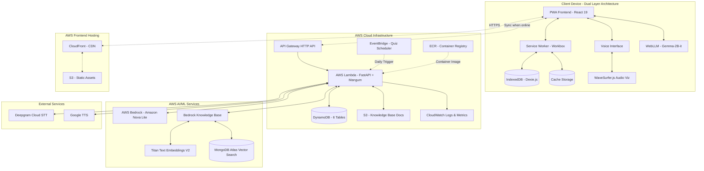
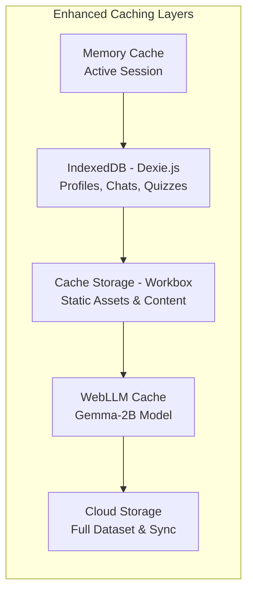

# Design Document: DigiMasterJi

## Project Status

**STATUS: COMPLETE AND DEPLOYED TO AWS**

DigiMasterJi has been fully implemented and deployed to AWS cloud infrastructure. The system is production-ready and accessible at [digimaster-ji.vercel.app](https://digimaster-ji.vercel.app/).

**Deployment Details:**

- Backend: AWS Lambda with Python FastAPI + Mangum adapter
- Database: DynamoDB (6 tables) + MongoDB Atlas (vector search)
- AI/ML: AWS Bedrock (Amazon Nova Lite + Titan Text Embeddings V2)
- Scheduling: EventBridge for automated quiz generation
- Speech: Deepgram Cloud API (primary STT)
- Infrastructure: API Gateway, S3, CloudWatch, ECR, CloudFront
- Frontend: React PWA hosted on AWS S3 + CloudFront

## Overview

DigiMasterJi is a voice-first, offline-first, multilingual AI-powered tutoring platform specifically designed for rural education in India, with advanced features addressing India's unique educational challenges. The system provides comprehensive educational support through curriculum-grounded AI responses, gamified learning experiences, and sophisticated offline capabilities.

The architecture prioritizes resilience, accessibility, and educational effectiveness in resource-constrained environments. Key design principles include dual-layer offline-first operation with browser-based LLM, privacy-conscious audio processing, Netflix-style multi-student profiles on shared devices, and strict curriculum alignment through RAG to prevent AI hallucinations.

## Architecture

### High-Level Architecture (AWS Production Deployment)



### Dual-Layer Offline-First Design Pattern

The system implements a **"Dual-Layer Offline-First with Browser LLM"** pattern:

1. **Layer 1 - Local Browser AI**: Complete AI functionality using WebLLM with Gemma-2B-it model (~1.5GB) running entirely in browser with WebGPU acceleration
2. **Layer 2 - Cloud Enhancement**: Enhanced AI using AWS Bedrock with Amazon Nova Lite Instruct when online
3. **Zero Latency Offline**: Instant AI responses without internet using cached browser-based LLM
4. **Seamless Transition**: Automatic switching between local and cloud AI based on connectivity
5. **Graceful Degradation**: Full functionality available offline with cached content and local AI processing

**Production Implementation Notes:**

- AWS Lambda runs Python FastAPI with Mangum adapter for serverless deployment
- DynamoDB provides scalable NoSQL storage with on-demand billing
- EventBridge replaces APScheduler for serverless cron-based quiz generation
- Bedrock Knowledge Base integrates with MongoDB Atlas for vector search
- CloudWatch provides centralized logging and monitoring

### Multi-Layer Caching Strategy



## Components and Interfaces

### 1. Progressive Web App (PWA) Frontend

**Technology Stack**: React 19 + Vite 7 + TypeScript + Workbox + TailwindCSS 4
**Deployment**: AWS S3 + CloudFront (production hosting)
**Key Features**:

- Service Worker with Workbox for advanced offline functionality
- Responsive design optimized for mobile devices
- Voice-first UI with minimal visual dependencies
- Netflix-style multi-student profile management
- Real-time audio visualization with WaveSurfer.js
- "Night School" audio-only mode for accessibility

**Core Components**:

```typescript
interface StudentProfile {
  id: string;
  name: string;
  preferredLanguage: string;
  gradeLevel: number;
  voiceSignature: string;
  learningProgress: LearningProgress;
  gamification: GamificationData;
  streaks: StreakData;
  badges: Badge[];
  xpPoints: number;
  level: number;
}

interface GamificationData {
  totalXP: number;
  currentLevel: number;
  dailyStreak: number;
  longestStreak: number;
  badges: Badge[];
  weeklyGoals: WeeklyGoal[];
  leaderboardRank: number;
}

interface VoiceInterface {
  startListening(language: string): Promise<void>;
  stopListening(): Promise<string>;
  speak(text: string, language: string): Promise<void>;
  setLanguage(language: string): void;
  visualizeAudio(audioStream: MediaStream): void;
  enableNightMode(): void;
}
```

### 2. Enhanced Voice Interface System

**Speech-to-Text**:

- Primary: Deepgram Cloud API (production deployment)
- Fallback: Browser Web Speech API (offline mode)
- Real-time audio visualization with WaveSurfer.js

**Text-to-Speech**:

- Primary: Google TTS (gTTS) with multilingual Indian voices
- Offline: Browser Speech Synthesis API
- Cached audio responses for common interactions

**Language Support**: Hindi, English, Bengali, Telugu, Marathi, Tamil, Gujarati, Kannada, Malayalam, Odia, Punjabi, Urdu, Nepali (15+ languages)

**Audio-Only "Night School" Mode**: Complete functionality without visual elements for late-night study or visual impairments

**Production Implementation**:

- Deepgram API integrated via AWS Lambda
- Audio files processed server-side and immediately discarded for privacy
- TTS responses cached in S3 for frequently requested content

```typescript
interface EnhancedSpeechProcessor {
  transcribe(audioBlob: Blob, language: string): Promise<string>;
  synthesize(
    text: string,
    language: string,
    voice?: string,
  ): Promise<AudioBuffer>;
  detectLanguage(audioBlob: Blob): Promise<string>;
  visualizeAudio(stream: MediaStream): WaveSurfer;
  enableNightMode(): void;
  processDeepgram(audio: Blob): Promise<string>;
  fallbackToWebSpeech(audio: Blob): Promise<string>;
}
```

### 3. Curriculum-Grounded RAG Engine

**Vector Database**: MongoDB Atlas Vector Search (integrated with Bedrock Knowledge Base)
**Embedding Model**: Amazon Titan Text Embeddings V2 (1024-dimensional)
**Content Source**: NCERT textbooks with optimized chunking strategy
**Chunking Strategy**: 500-token chunks with 50-token overlap for optimal context retrieval

**Production Implementation**:

- AWS Bedrock Knowledge Base manages RAG pipeline
- S3 bucket stores PDF documents
- MongoDB Atlas provides vector search backend
- Titan Embeddings V2 generates high-quality embeddings
- Bedrock Retrieve API handles semantic search

**Enhanced RAG Pipeline**:

1. **Document Processing**: PDF upload to S3 → Bedrock ingestion → Titan embedding generation → MongoDB Atlas storage
2. **Query Processing**: Voice/text input → Query embedding via Titan
3. **Semantic Retrieval**: Vector similarity search in MongoDB Atlas via Bedrock
4. **Context-Aware Generation**: Dual LLM mode (WebLLM offline / Bedrock Amazon Nova Lite online)
5. **Learning Insights**: RAG-enhanced recommendations for weak topics
6. **Response Delivery**: Text → Speech synthesis with citations

```python
# Production Python implementation
from typing import List, Dict
from pydantic import BaseModel

class NCERTSource(BaseModel):
    textbook: str
    chapter: str
    section: str
    page: int
    content: str
    confidence: float

class RAGResponse(BaseModel):
    answer: str
    sources: List[NCERTSource]
    confidence: float
    language: str
    relatedTopics: List[str]
    difficultyLevel: int

class LearningInsight(BaseModel):
    type: str  # 'weakness' | 'strength' | 'recommendation'
    subject: str
    topic: str
    description: str
    ragContext: List[NCERTSource]
    actionable: bool
    priority: str  # 'high' | 'medium' | 'low'

class EnhancedRAGEngine:
    async def process_document(self, pdf_file: bytes, metadata: Dict) -> None:
        """Upload PDF to S3 and trigger Bedrock ingestion"""
        pass

    async def query(self, question: str, student_context: Dict) -> RAGResponse:
        """Query Bedrock Knowledge Base with student context"""
        pass

    async def generate_insights(self, student_history: List[Dict]) -> List[LearningInsight]:
        """Generate AI-powered learning insights"""
        pass

    async def validate_response(self, response: str, sources: List[NCERTSource]) -> bool:
        """Validate response against NCERT sources"""
        pass
```

### 4. Dual-Layer Offline Data Management

**IndexedDB with Dexie.js Schema**:

```typescript
interface EnhancedOfflineDatabase {
  students: StudentProfile[];
  conversations: Conversation[];
  messages: Message[];
  quizzes: GeneratedQuiz[];
  learningInsights: LearningInsight[];
  cachedContent: CachedNCERTContent[];
  pendingSync: SyncOperation[];
  gamificationData: GamificationData[];
  badges: Badge[];
  streakHistory: StreakRecord[];
}

interface WebLLMCache {
  modelPath: string;
  modelSize: number; // ~1.5GB for Gemma-2B-it
  lastLoaded: Date;
  isReady: boolean;
}
```

**Enhanced Sync Manager with Conflict Resolution**:

```typescript
interface EnhancedSyncManager {
  queueOperation(operation: SyncOperation): void;
  syncWhenOnline(): Promise<SyncResult>;
  resolveConflicts(conflicts: DataConflict[]): Promise<void>;
  prioritizeSync(operations: SyncOperation[]): SyncOperation[];
  handleMultiDayOffline(offlineDays: number): Promise<void>;
  mergeGamificationData(
    local: GamificationData,
    cloud: GamificationData,
  ): GamificationData;
}
```

### 5. Dual-Mode AI System

**Browser-Based AI (Offline)**:

- WebLLM with @mlc-ai/web-llm
- Gemma-2B-it-q4f32_1-MLC model (~1.5GB)
- WebGPU acceleration for performance
- Zero latency responses without internet

**Cloud-Based AI (Online - Production)**:

- AWS Bedrock with Amazon Nova Lite
- Model ID: `us.amazon.nova-lite-v1:0`
- Enhanced reasoning capabilities for complex queries
- Integrated with Bedrock Knowledge Base for RAG

**Production Implementation**:

- Lambda function invokes Bedrock via boto3
- Streaming responses supported for better UX
- Automatic fallback to WebLLM when offline
- CloudWatch logs all AI interactions for monitoring

```python
# Production Python implementation
from typing import Optional, List, Dict
import boto3
from pydantic import BaseModel

class RAGContext(BaseModel):
    sources: List[Dict]
    studentProfile: Dict
    conversationHistory: List[Dict]

class DualModeAI:
    def __init__(self):
        self.bedrock_client = boto3.client('bedrock-runtime')
        self.bedrock_agent_client = boto3.client('bedrock-agent-runtime')

    async def generate_cloud_response(
        self,
        prompt: str,
        context: RAGContext
    ) -> str:
        """Generate response using AWS Bedrock Amazon Nova Lite"""
        pass

    async def query_knowledge_base(
        self,
        query: str,
        kb_id: str
    ) -> List[Dict]:
        """Query Bedrock Knowledge Base for RAG context"""
        pass

    def select_optimal_mode(self) -> str:
        """Determine if online (Bedrock) or offline (WebLLM)"""
        return 'online' if self._check_connectivity() else 'offline'

class WebLLMConfig(BaseModel):
    modelId: str = 'Gemma-2B-it-q4f32_1-MLC'
    modelSize: int = 1536  # MB
    webgpuEnabled: bool = True
    maxTokens: int = 2048
```

### 6. Advanced Gamified Learning System

**Comprehensive Gamification Engine**:

```python
# Production Python implementation
from typing import List, Dict
from datetime import datetime
from pydantic import BaseModel

class Badge(BaseModel):
    id: str
    name: str
    description: str
    icon: str
    criteria: Dict
    earnedDate: Optional[datetime] = None

class StreakData(BaseModel):
    currentStreak: int
    longestStreak: int
    lastActivity: datetime
    streakRecoveryUsed: bool
    weeklyGoalMet: bool

class GamificationEngine:
    async def calculate_xp(self, activity: Dict) -> int:
        """Calculate XP for learning activities"""
        pass

    async def update_streak(self, student_id: str, activity_date: datetime) -> StreakData:
        """Update daily streak data"""
        pass

    async def check_badge_eligibility(self, student: Dict) -> List[Badge]:
        """Check and award eligible badges"""
        pass

    async def generate_leaderboard(self, family_profiles: List[Dict]) -> List[Dict]:
        """Generate family leaderboard"""
        pass

    async def handle_missed_days(self, student_id: str, missed_days: int) -> Dict:
        """Handle missed quiz days and backlog"""
        pass

# 15+ Achievement Badges
AVAILABLE_BADGES = [
    'First Steps', 'On Fire', 'Week Warrior', 'Perfectionist',
    'Math Wizard', 'Science Explorer', 'Language Master', 'Quiz Champion',
    'Streak Keeper', 'Night Owl', 'Early Bird', 'Comeback Kid',
    'Helper', 'Curious Mind', 'Problem Solver'
]
```

**Automated Quiz Generation with EventBridge**:

```python
# Production implementation using EventBridge + Lambda
class QuizScheduler:
    async def generate_daily_quiz(self, student_id: str) -> Dict:
        """Generate personalized daily quiz"""
        pass

    async def lambda_handler(self, event: Dict, context: Dict) -> Dict:
        """EventBridge trigger handler for daily quiz generation"""
        # Triggered at midnight IST (18:30 UTC) daily
        pass

    async def handle_missed_quizzes(self, student_id: str) -> Dict:
        """Handle quiz backlog for missed days"""
        pass

    async def adapt_difficulty(self, student_history: List[Dict]) -> int:
        """Adapt quiz difficulty based on performance"""
        pass
```

**Production Deployment**:

- EventBridge rule triggers Lambda at midnight IST daily
- Separate Lambda function (`digimasterji-quiz-scheduler`) handles quiz generation
- DynamoDB stores quiz data with status tracking
- CloudWatch monitors quiz generation success/failure

### 7. AI-Powered Learning Analytics

**Automated Insight Generation**:

```python
# Production Python implementation
from typing import List, Dict, Optional
from datetime import datetime
from pydantic import BaseModel

class LearningInsight(BaseModel):
    id: str
    studentId: str
    type: str  # 'strength' | 'weakness' | 'recommendation' | 'trend'
    subject: str
    topic: str
    description: str
    ragEnhancedContent: List[Dict]
    actionable: bool
    priority: str  # 'high' | 'medium' | 'low'
    generatedAt: datetime
    language: str

class PerformanceAnalysis(BaseModel):
    subjectWisePerformance: Dict[str, float]
    improvementTrends: List[Dict]
    consistencyScore: float
    recommendedFocusAreas: List[str]
    visualizationData: Dict

class LearningAnalytics:
    async def generate_insights(self, student_id: str) -> List[LearningInsight]:
        """Generate AI-powered learning insights using Bedrock"""
        pass

    async def analyze_performance_trends(self, quiz_history: List[Dict]) -> PerformanceAnalysis:
        """Analyze performance trends over time"""
        pass

    async def identify_weak_topics(self, student_data: Dict) -> List[Dict]:
        """Identify weak topics using quiz results and chat history"""
        pass

    async def generate_recommendations(self, insights: List[LearningInsight]) -> List[Dict]:
        """Generate actionable study recommendations"""
        pass

    async def create_bilingual_report(self, insights: List[LearningInsight], language: str) -> Dict:
        """Create analytics report in student's preferred language"""
        pass
```

**Background Task Integration**:

```python
# EventBridge-triggered analytics generation
class AnalyticsScheduler:
    async def trigger_insight_generation(
        self,
        student_id: str,
        trigger: str  # 'quiz_completed' | 'daily' | 'weekly'
    ) -> None:
        """Trigger insight generation based on events"""
        pass

    async def schedule_performance_analysis(self, student_id: str) -> None:
        """Schedule weekly performance analysis"""
        pass

    async def update_learning_patterns(self, student_id: str) -> None:
        """Update learning pattern analysis"""
        pass
```

**Production Implementation**:

- Bedrock Amazon Nova Lite generates insights from quiz and chat data
- DynamoDB stores analytics data with efficient querying
- EventBridge triggers weekly analytics generation
- CloudWatch monitors analytics generation performance

### 8. Backend Services (AWS Serverless Architecture)

**Technology Stack**: Python 3.11 + FastAPI + Mangum (Lambda adapter) + Boto3

**Enhanced API Gateway + Lambda Functions**:

- `/auth/register` - User registration with phone/email
- `/auth/login` - JWT-based authentication
- `/profiles/*` - Netflix-style profile management
- `/chat/sessions/*` - Conversation management with RAG
- `/chat/sessions/{id}/voice` - Voice message processing (Deepgram STT)
- `/chat/sessions/{id}/speak` - Text-to-speech generation (gTTS)
- `/quizzes/*` - Quiz generation, submission, and analytics
- `/quizzes/leaderboard` - Family leaderboard
- `/quizzes/insights` - AI-powered learning insights
- `/admin/upload` - PDF document upload to S3
- `/admin/sync-kb` - Trigger Bedrock Knowledge Base sync
- `/sync/pull` - Offline data synchronization

**DynamoDB Tables (6 tables with GSIs)**:

```python
# Production DynamoDB schema
from typing import Optional, List, Dict
from datetime import datetime
from pydantic import BaseModel

# digimasterji-users
class UserDocument(BaseModel):
    userId: str  # Partition Key
    email: Optional[str]
    phone: Optional[str]
    passwordHash: str
    createdAt: datetime
    lastLogin: datetime
    # GSI: email-index, phone-index

# digimasterji-profiles
class ProfileDocument(BaseModel):
    userId: str  # Partition Key
    profileId: str  # Sort Key
    name: str
    gradeLevel: int
    preferredLanguage: str
    gamificationData: Dict
    streaks: Dict
    badges: List[str]
    xpPoints: int
    level: int
    # GSI: profileId-index

# digimasterji-conversations
class ConversationDocument(BaseModel):
    profileId: str  # Partition Key
    conversationId: str  # Sort Key
    title: str
    createdAt: datetime
    updatedAt: datetime
    messageCount: int
    # GSI: conversationId-index

# digimasterji-messages
class MessageDocument(BaseModel):
    conversationId: str  # Partition Key
    messageId: str  # Sort Key
    profileId: str
    role: str  # 'user' | 'assistant'
    content: str
    timestamp: datetime
    ragSources: Optional[List[Dict]]
    # GSI: messageId-index, profileId-timestamp-index

# digimasterji-quizzes
class QuizDocument(BaseModel):
    profileId: str  # Partition Key
    quizId: str  # Sort Key
    status: str  # 'pending' | 'completed' | 'missed'
    questions: List[Dict]
    answers: Optional[List[Dict]]
    score: Optional[float]
    generatedAt: datetime
    completedAt: Optional[datetime]
    # GSI: quizId-index, status-index

# digimasterji-knowledge-base
class KnowledgeBaseDocument(BaseModel):
    document

## Production Deployment Considerations

### AWS Infrastructure

**Serverless Architecture Benefits**:
- Zero server management and automatic scaling
- Pay-per-use pricing model (cost-effective for variable load)
- Built-in high availability and fault tolerance
- Automatic security patches and updates

**Lambda Function Optimization**:
- Container image deployment via ECR for consistent environments
- 1024 MB memory allocation balances cost and performance
- 120-second timeout for API requests, 300 seconds for scheduled tasks
- Environment variables for configuration (no hardcoded secrets)
- CloudWatch Logs for debugging and monitoring

**DynamoDB Design Patterns**:
- On-demand billing mode for unpredictable workloads
- Global Secondary Indexes (GSIs) for efficient querying
- Composite keys (partition + sort) for hierarchical data
- Single-table design considered but multi-table chosen for clarity
- Point-in-time recovery enabled for data protection

**API Gateway Configuration**:
- HTTP API (cheaper and faster than REST API)
- CORS enabled for frontend access from CloudFront
- Custom domain name support for production
- Request throttling and rate limiting
- CloudWatch metrics for monitoring

**EventBridge Scheduler**:
- Cron expression: `cron(30 18 * * ? *)` (midnight IST)
- Separate Lambda function for quiz generation
- Retry policy with exponential backoff
- Dead-letter queue for failed invocations
- CloudWatch alarms for monitoring

**Bedrock Knowledge Base**:
- MongoDB Atlas M0 (free tier) for prototype
- Titan Text Embeddings V2 for high-quality embeddings
- S3 bucket for document storage with versioning
- Automatic sync via Bedrock data source ingestion
- Vector search with configurable similarity threshold

**Security Best Practices**:
- IAM roles with least-privilege permissions
- Secrets stored in environment variables (not in code)
- HTTPS-only communication via API Gateway
- JWT tokens for authentication with expiration
- Audio data immediately discarded after processing
- S3 bucket with private access and encryption

**Cost Optimization**:
- DynamoDB on-demand pricing (no wasted capacity)
- Lambda memory tuned for optimal cost/performance
- Bedrock Amazon Nova Lite (cheaper than larger models)
- S3 lifecycle policies for old documents
- CloudWatch log retention policies (7-30 days)
- MongoDB Atlas free tier for prototype phase

**Monitoring and Observability**:
- CloudWatch Logs for all Lambda functions
- CloudWatch Metrics for API Gateway and DynamoDB
- CloudWatch Alarms for error rates and latency
- X-Ray tracing for distributed request tracking
- Custom metrics for business KPIs (quiz completion, XP earned)

**Disaster Recovery**:
- DynamoDB point-in-time recovery enabled
- S3 versioning for document history
- Lambda function versioning and aliases
- Infrastructure as Code (IaC) for reproducibility
- Regular backup testing and restoration drills

**Scalability Considerations**:
- Lambda auto-scales to handle concurrent requests
- DynamoDB auto-scales with on-demand mode
- API Gateway handles millions of requests
- Bedrock Knowledge Base scales with data volume
- Frontend CDN (CloudFront) for global distribution

**Development Workflow**:
- Local development with FastAPI + Uvicorn
- Docker for consistent build environments
- `deploy.sh` script for automated deployments
- Environment-specific configurations (dev/staging/prod)
- CI/CD pipeline integration ready

**Frontend Deployment (S3 + CloudFront)**:
- S3 bucket for static asset storage
- CloudFront CDN for global distribution
- deploy-aws.sh script for automated deployments
- Environment variables for API endpoints
- Custom domain support with ACM SSL

### Migration from Original Design

**Key Changes from Design to Implementation**:

| Original Design | Production Implementation | Reason |
|----------------|---------------------------|--------|
| MongoDB Atlas (primary DB) | DynamoDB (primary) + MongoDB Atlas (vector search only) | Better AWS integration, serverless scaling |
| OpenAI Whisper (local) | Deepgram Cloud API | Simpler deployment, no model hosting |
| Ollama Cloud (Gemma 3) | AWS Bedrock (Amazon Nova Lite) | Native AWS integration, managed service |
| APScheduler | EventBridge + Lambda | Serverless cron, no persistent server |
| sentence-transformers embeddings | Titan Text Embeddings V2 | Higher quality, managed service |
| Node.js/TypeScript backend | Python FastAPI | Better ML/AI library ecosystem |
| DuckDuckGo web search | Removed from MVP | Scope reduction for hackathon |

**Preserved Design Principles**:
- Offline-first architecture with WebLLM
- Voice-first interface with multilingual support
- Curriculum-grounded RAG pipeline
- Netflix-style multi-profile system
- Gamification with XP, streaks, and badges
- Privacy-conscious audio processing
- PWA with service worker caching

## Correctness Properties

*A property is a characteristic or behavior that should hold true across all valid executions of a system—essentially, a formal statement about what the system should do. Properties serve as the bridge between human-readable specifications and machine-verifiable correctness guarantees.*

Based on the prework analysis and property reflection to eliminate redundancy, the following properties ensure DigiMasterJi operates correctly across all scenarios:

### Property 1: Multilingual Voice Processing Accuracy
*For any* valid audio input in supported Indian languages, the Voice_Interface should convert speech to text with accuracy above the specified threshold (90% for clear audio, 80% with background noise), and convert any generated text response back to natural speech in the student's preferred language.
**Validates: Requirements 1.1, 1.2, 1.4**

### Property 2: Complete Offline Functionality
*For any* core system operation (learning sessions, quiz generation, progress tracking, profile management), the DigiMasterJi_System should provide full functionality when internet connectivity is unavailable, using only cached content and local storage.
**Validates: Requirements 2.1, 5.4, 9.1, 10.4**

### Property 3: Data Synchronization Integrity
*For any* offline data created during disation
# Triggered by EventBridge rule: cron(30 18 * * ? *)
# Runs at midnight IST (18:30 UTC) daily

async def lambda_handler(event: Dict, context: Dict) -> Dict:
    """
    EventBridge-triggered quiz generation
    Generates daily quizzes for all active profiles
    """
    # Implementation in app/services/quiz_scheduler.py
    pass
```

**Production Deployment**:

- Docker image built and pushed to ECR
- Lambda function uses container image deployment
- API Gateway HTTP API with CORS configuration
- CloudWatch Logs for monitoring and debugging
- IAM role with least-privilege permissionsconnected usage, when connectivity is restored, the Sync_Manager should merge all data with cloud storage without loss, prioritizing local data over cloud data to prevent progress loss, and resolving conflicts automatically.
  **Validates: Requirements 2.3, 7.1, 7.2, 7.3**

### Property 4: Curriculum-Aligned Content Generation

_For any_ student question within the curriculum scope, the RAG_Engine should generate responses using only NCERT textbook content as source material, include proper citations with textbook sections and page numbers, and ensure responses align with the student's grade level and subject.
**Validates: Requirements 3.1, 3.3, 3.4, 3.5**

### Property 5: Multi-Student Profile Isolation

_For any_ device with multiple student profiles, the DigiMasterJi_System should maintain complete data separation between profiles, enable voice-based authentication for profile switching, and preserve individual progress tracking both offline and during synchronization.
**Validates: Requirements 4.1, 4.2, 4.3, 4.5**

### Property 6: Adaptive Quiz Generation

_For any_ completed learning session, the DigiMasterJi_System should generate quiz questions based on covered topics, adapt difficulty based on the student's performance history, and provide NCERT-based explanations for incorrect answers with suggested review topics.
**Validates: Requirements 5.1, 5.2, 5.3**

### Property 7: Privacy-Compliant Audio Processing

_For any_ voice input processing, the Voice_Interface should convert audio to text and immediately discard the raw audio data, store only learning progress and preferences (never raw audio), and process speech locally when operating offline without external server communication.
**Validates: Requirements 6.1, 6.4, 6.3**

### Property 8: Resilient Sync Operations

_For any_ sync operation that fails due to network issues, the Sync_Manager should retry with exponential backoff up to 5 attempts while allowing normal system operation to continue without blocking user interactions.
**Validates: Requirements 7.4, 7.5**

### Property 9: Content Management Pipeline

_For any_ NCERT PDF uploaded by administrators, the Admin_Dashboard should process and index the content for RAG retrieval, version the changes, notify connected devices for cache updates, and provide detailed error messages with retry options if processing fails.
**Validates: Requirements 8.1, 8.2, 8.4**

### Property 10: Resource-Constrained Performance

_For any_ device with limited resources (minimum 100MB storage, 2GB RAM, low battery, constrained bandwidth), the DigiMasterJi_System should maintain responsive performance by optimizing processing intensity and prioritizing essential content while preserving core functionality.
**Validates: Requirements 9.2, 9.4, 9.5**

### Property 11: Intelligent Progress Analytics

_For any_ student learning activity, the DigiMasterJi_System should track progress across subjects and topics, identify knowledge gaps, suggest focus areas, present analytics in the student's preferred language, and recommend additional practice sessions when progress patterns indicate learning difficulties.
**Validates: Requirements 10.1, 10.2, 10.3, 10.5**

### Property 12: Language Switching Continuity

_For any_ active learning session, when a student switches languages mid-session, the DigiMasterJi_System should seamlessly adapt and continue the conversation in the new language without losing context or progress.
**Validates: Requirements 1.3**

### Property 13: Cache Management Optimization

_For any_ storage constraint scenario, the DigiMasterJi_System should prioritize caching based on the student's current curriculum level, ensure essential content is cached for at least 7 days of offline usage on first install, and update offline caches when new content becomes available during sync opportunities.
**Validates: Requirements 2.4, 2.5, 8.5**

### Property 14: Out-of-Curriculum Handling

_For any_ student question that cannot be answered using available NCERT content, the RAG_Engine should inform the student that the topic is outside the current curriculum rather than generating potentially inaccurate responses.
**Validates: Requirements 3.2**

### Property 15: Performance Response Times

_For any_ profile switching operation, the DigiMasterJi_System should complete the transition within 3 seconds, maintaining user experience standards even on resource-constrained devices.
**Validates: Requirements 4.4**

### Property 16: Automated Review System

_For any_ student who hasn't used the system for 24 hours, the DigiMasterJi_System should automatically prepare a review quiz covering recent topics to reinforce learning and maintain engagement.
**Validates: Requirements 5.5**

### Property 17: Data Encryption and Transmission Security

_For any_ cloud-based speech processing operation, the DigiMasterJi_System should encrypt audio data during transmission to ensure privacy and security compliance.
**Validates: Requirements 6.2**

### Property 18: Complete Data Deletion

_For any_ student profile deletion request, the DigiMasterJi_System should permanently remove all associated data within 24 hours, ensuring complete privacy compliance.
**Validates: Requirements 6.5**

### Property 19: Curriculum Content Mapping

_For any_ curriculum management operation, the Admin_Dashboard should allow proper mapping of content to specific grades and subjects, ensuring educational alignment and appropriate content delivery.
**Validates: Requirements 8.3**

### Property 20: Bandwidth-Optimized Content Delivery

_For any_ network bandwidth constraint scenario, the DigiMasterJi_System should prioritize essential content downloads to ensure core functionality remains available even under limited connectivity conditions.
**Validates: Requirements 9.3**

## Error Handling

### Voice Interface Error Handling

**Speech Recognition Failures**:

- Fallback to browser Web Speech API when Whisper fails
- Request audio re-recording for unclear speech
- Provide visual feedback when audio-only mode is disabled
- Maintain conversation context across recognition attempts

**Language Detection Errors**:

- Default to student's preferred language from profile
- Allow manual language selection override
- Graceful degradation to English/Hindi as fallback languages

### Offline Operation Error Handling

**Storage Quota Exceeded**:

- Implement intelligent cache eviction based on usage patterns
- Prioritize current curriculum content over older materials
- Notify users when storage is critically low
- Provide cache management options

**Sync Conflict Resolution**:

- Timestamp-based conflict resolution with local data priority
- Merge non-conflicting changes automatically
- Flag irreconcilable conflicts for manual review
- Maintain audit trail of sync operations

### RAG System Error Handling

**Content Retrieval Failures**:

- Graceful degradation to cached content when vector search fails
- Clear messaging when content is unavailable
- Suggest alternative topics within available content
- Log retrieval failures for system monitoring

**Generation Quality Control**:

- Validate generated responses against NCERT source material
- Reject responses that cannot be properly cited
- Implement confidence scoring for generated content
- Fallback to direct NCERT quotes for low-confidence responses

### Network and Connectivity Errors

**Intermittent Connectivity**:

- Queue operations for background sync when connection is restored
- Implement exponential backoff for failed network requests
- Provide clear offline/online status indicators
- Cache critical responses for offline access

**API Service Failures**:

- Graceful degradation to offline-only mode
- Retry mechanisms with circuit breaker patterns
- Alternative service endpoints for redundancy
- User notification of service limitations

## Testing Strategy

### Dual Testing Approach

DigiMasterJi requires comprehensive testing through both unit tests and property-based tests to ensure reliability in diverse rural deployment scenarios.

**Unit Tests** focus on:

- Specific examples of voice recognition in different Indian languages
- Edge cases like extremely low storage or poor network conditions
- Integration points between PWA, service workers, and IndexedDB
- Error conditions such as corrupted cache data or malformed NCERT content
- Specific user workflows like profile switching and quiz generation
- AWS Lambda function handlers and API endpoints
- DynamoDB operations and data integrity
- Bedrock API integration and error handling

**Property-Based Tests** focus on:

- Universal properties that hold across all inputs and scenarios
- Comprehensive input coverage through randomization of student profiles, content, and device conditions
- Stress testing with generated data representing diverse rural usage patterns
- Validation of correctness properties across different languages and curriculum levels

### Property-Based Testing Configuration

**Testing Framework**: Fast-check (JavaScript/TypeScript property-based testing library)
**Minimum Iterations**: 100 per property test to account for randomization
**Test Environment**: Simulated offline conditions with controlled network connectivity

**Property Test Tagging Format**:
Each property-based test must include a comment referencing its design document property:

```typescript
// Feature: digimasterji, Property 1: Multilingual Voice Processing Accuracy
```

**Key Testing Scenarios**:

1. **Multi-Language Voice Processing**: Generate random audio samples across 15+ Indian languages with varying quality and background noise levels
2. **Offline-First Operations**: Simulate extended offline periods (days/weeks) with various user activities and sync scenarios
3. **Resource Constraints**: Test on simulated low-end devices with limited RAM, storage, and processing power
4. **Content Variety**: Generate diverse NCERT content scenarios across different subjects and grade levels
5. **Multi-Student Usage**: Simulate families with multiple students sharing devices with different learning patterns

**Unit Test Focus Areas**:

1. **Voice Interface Integration**: Test Deepgram API integration and fallback mechanisms
2. **PWA Service Worker**: Test cache strategies and offline functionality edge cases
3. **IndexedDB Operations**: Test data integrity during storage quota limitations
4. **RAG Pipeline**: Test Bedrock Knowledge Base retrieval accuracy and citation generation
5. **Sync Conflict Resolution**: Test specific conflict scenarios and resolution strategies
6. **Lambda Functions**: Test FastAPI endpoints, authentication, and error handling
7. **DynamoDB Operations**: Test CRUD operations, GSI queries, and data consistency
8. **EventBridge Scheduler**: Test quiz generation timing and backlog handling

**AWS Integration Testing**:

- Lambda function invocation with various payloads
- DynamoDB table operations and GSI queries
- S3 document upload and retrieval
- Bedrock API calls and Knowledge Base queries
- EventBridge rule triggering and Lambda execution
- CloudWatch log verification

**Performance Testing**:

- Load testing with multiple concurrent students on shared devices
- Memory usage testing during extended offline periods
- Battery consumption testing during intensive voice processing
- Network efficiency testing under various connectivity conditions
- Lambda cold start optimization
- DynamoDB read/write capacity monitoring

**Accessibility Testing**:

- Complete audio-only mode functionality verification
- Screen reader compatibility for visual elements
- Voice navigation testing across all system features
- Low-light and no-light usage scenario testing

**Security and Privacy Testing**:

- Audio data handling and immediate disposal verification
- Local storage encryption and data protection testing
- Network transmission security validation (HTTPS)
- Profile isolation and data separation verification
- JWT token validation and expiration handling
- IAM permission verification for least-privilege access

**Production Deployment Testing**:

- End-to-end testing on AWS infrastructure
- API Gateway CORS configuration validation
- Lambda function timeout and memory optimization
- DynamoDB table capacity and performance
- Bedrock Knowledge Base sync verification
- EventBridge scheduler reliability testing
- CloudWatch alarm configuration and monitoring

The testing strategy ensures DigiMasterJi meets the rigorous reliability requirements for deployment in rural educational environments where technical support may be limited and usage patterns are diverse.
